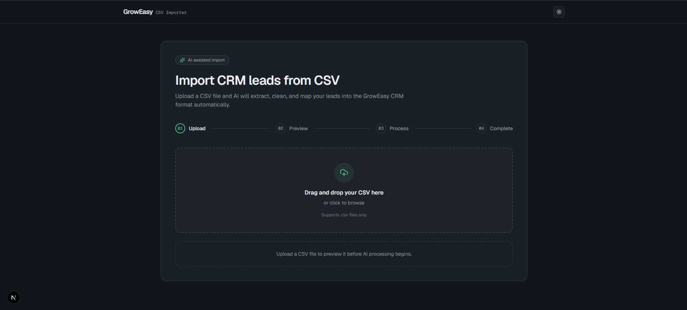
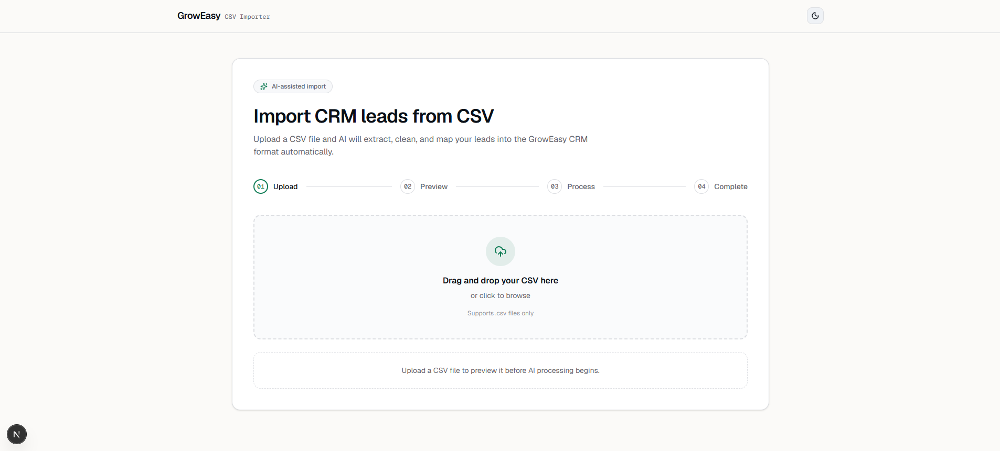
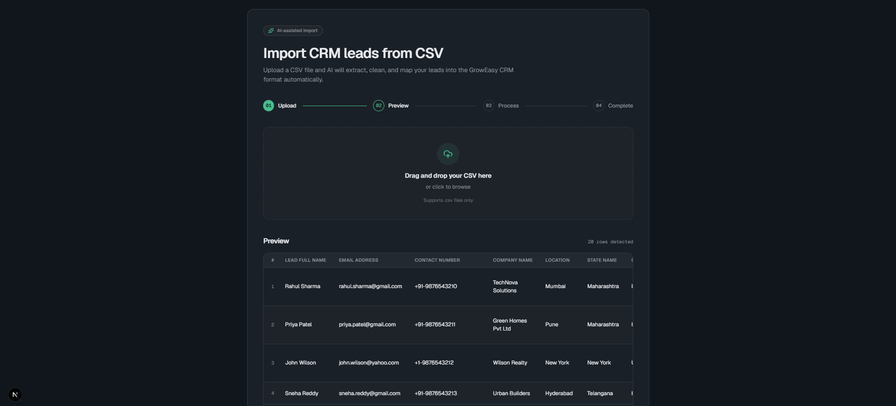
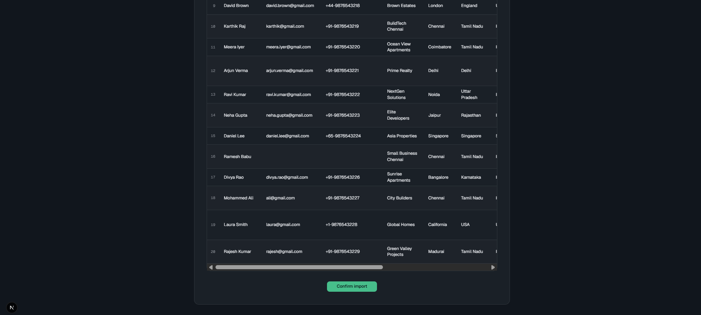
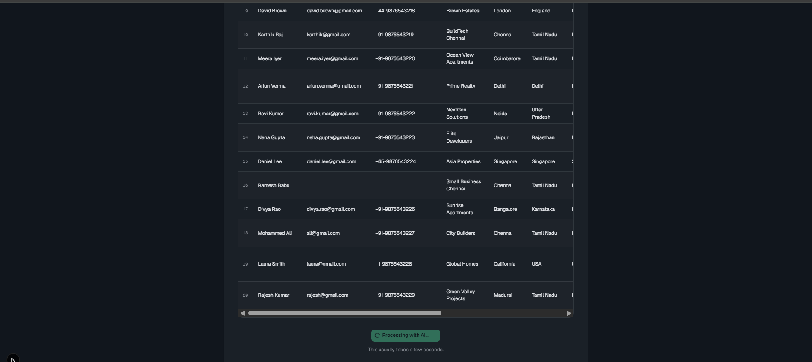
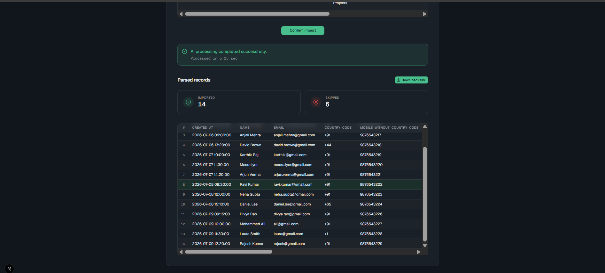
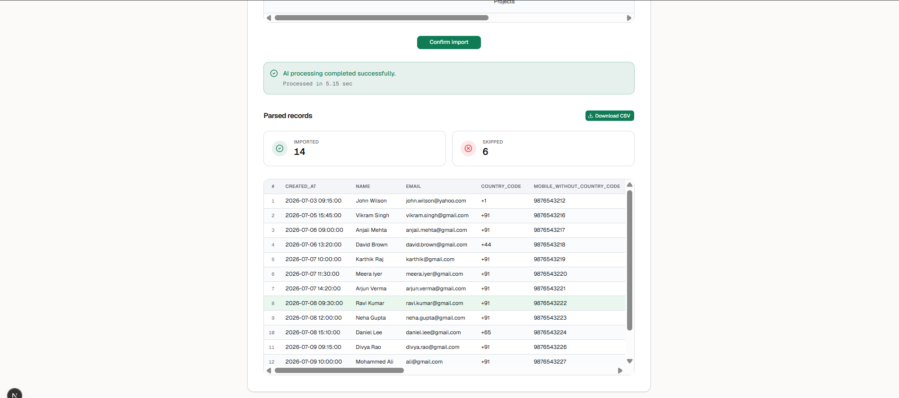
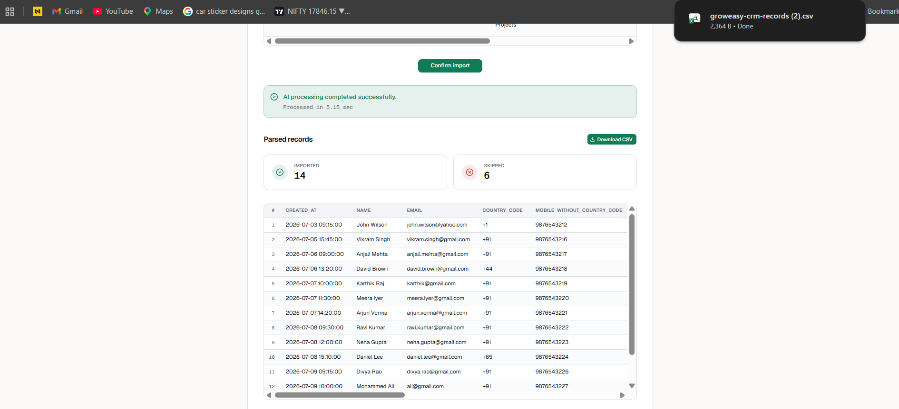

# GrowEasy AI-Powered CSV Importer

An AI-powered CSV importer built for the **GrowEasy Software Developer Internship Assignment**. It extracts CRM lead data from CSV files of arbitrary structure and column naming, then normalizes the output into GrowEasy's standard CRM schema.


---

## Live Demo

- **Hosted Application:** [groweasy-ai-csv-importer-z8pn.vercel.app](https://groweasy-ai-csv-importer-z8pn.vercel.app)
- **GitHub Repository:** [github.com/afrosejamal/groweasy-ai-csv-importer](https://github.com/afrosejamal/groweasy-ai-csv-importer)

---

## Overview

Most CRM import tools require CSV files to match a predefined column layout. This project removes that constraint: users can upload **any valid CRM CSV**, regardless of its structure, and the backend uses an LLM to interpret the data and map it into GrowEasy's required fields.

Tested against CSV exports commonly seen in the wild, including:

- Facebook Lead Ads exports
- Google Ads lead exports
- Real estate CRM exports
- Marketing agency reports
- Sales reports and manually created spreadsheets
- Custom / non-standard CRM exports

---

## How the AI Mapping Works

Rather than relying on hardcoded column-name matching, the model interprets the **meaning** of each column and maps it to the correct CRM field — so differently named or ordered columns still resolve correctly.

| Example CSV Column | Mapped CRM Field |
|---|---|
| Full Name, Customer, Contact Person | `name` |
| Email Address, Mail | `email` |
| Phone, Mobile Number | `mobile_without_country_code` |
| Notes, Remarks | `crm_note` |
| Source | `data_source` |

### Extracted CRM Fields

`created_at` · `name` · `email` · `country_code` · `mobile_without_country_code` · `company` · `city` · `state` · `country` · `lead_owner` · `crm_status` · `crm_note` · `data_source` · `possession_time` · `description`

---

## Features

**Frontend**
- Drag-and-drop and file-picker CSV upload
- Pre-processing CSV preview with sticky headers and independent horizontal/vertical scrolling
- Real-time processing state (parsing, uploading, AI processing) with clear loading indicators
- Import summary cards (records imported vs. skipped) and processing-time display
- Parsed CRM records table with CSV export
- Full dark mode support, responsive across breakpoints

**Backend**
- CSV upload and parsing API
- AI-powered field extraction and mapping via LLM
- Batch processing of records
- Record validation, with invalid rows skipped rather than failing the whole import
- Structured JSON responses and centralized error handling
- Retry logic for transient AI request failures
- Dockerized for consistent local development

---

## Tech Stack

| Layer | Technology |
|---|---|
| Frontend | Next.js, React, TypeScript, Tailwind CSS, PapaParse |
| Backend | Node.js, Express.js, TypeScript, Multer, CSV Parser |
| AI | Groq API (LLM inference), prompt engineering |
| Deployment | Vercel — frontend and backend deployed together as a single multi-service project (`vercel.json`), served from one domain |
| Containerization | Docker, Docker Compose (local development) |

---

## Application Workflow

```
Upload CSV
    │
    ▼
CSV Preview
    │
    ▼
Confirm Import
    │
    ▼
Backend receives CSV
    │
    ▼
CSV Parsing
    │
    ▼
Batch Processing
    │
    ▼
AI Field Extraction
    │
    ▼
Validation
    │
    ▼
Structured CRM JSON
    │
    ▼
Frontend Result Table
    │
    ▼
Download Processed CSV
```

---

## Project Structure

```
groweasy-ai-csv-importer/
├── frontend/
│   ├── src/
│   ├── public/
│   └── Dockerfile
├── backend/
│   ├── src/
│   ├── Dockerfile
│   └── .env
├── vercel.json          # multi-service deployment config (frontend + backend on one domain)
├── docker-compose.yml
├── README.md
├── Screenshot/
│   ├── screenshot1.png
│   ├── screenshot2.png
│   ├── screenshot3.png
│   ├── screenshot4.png
│   ├── screenshot5.png
│   ├── screenshot6.png
│   ├── screenshot7.png
│   └── screenshot8.png
└── Demo/
    └── demo_GrowEasy.mp4
```

---

## Deployment Architecture

The frontend and backend are deployed together as a single Vercel project using **Vercel Services**, defined in `vercel.json`. This routes traffic on one domain:

- Requests to `/api/backend/*` → routed to the Express backend service
- All other requests → routed to the Next.js frontend service

This means there is only **one live URL** to visit — the frontend and backend are not hosted separately.

---

## Getting Started

### Clone the repository

```bash
git clone https://github.com/afrosejamal/groweasy-ai-csv-importer.git
cd groweasy-ai-csv-importer
```

### Backend setup

```bash
cd backend
npm install
```

Create a `.env` file in `backend/`:

```
GROQ_API_KEY=your_api_key
PORT=5000
```

Run the backend:

```bash
npm run dev
```

Backend available at `http://localhost:5000`.

### Frontend setup

```bash
cd frontend
npm install
```

Create a `.env.local` file in `frontend/` (for local development only):

```
NEXT_PUBLIC_API_URL=http://localhost:5000
```

Run the frontend:

```bash
npm run dev
```

Frontend available at `http://localhost:3000`.

### Run with Docker

```bash
docker compose up --build
```

---

## Screenshots

<!-- TODO: replace each "Screenshot N" caption below with what it actually shows (e.g. Home Page, CSV Preview, AI Processing, Parsed Records, Dark Mode) -->

| Screenshot 1 | Screenshot 2 |
|---|---|
|  |  |

| Screenshot 3 | Screenshot 4 |
|---|---|
|  |  |

| Screenshot 5 | Screenshot 6 |
|---|---|
|  |  |

| Screenshot 7 | Screenshot 8 |
|---|---|
|  |  |

## Demo Video

[`Demo/demo_GrowEasy.mp4`](Demo/demo_GrowEasy.mp4) — walks through upload, preview, AI processing, parsed records, and CSV download end to end.

> GitHub doesn't play video files inline in the README preview — viewers will need to click through and download/stream it from the repo. If you'd rather it play inline, consider uploading it to YouTube (unlisted is fine) and embedding a thumbnail link instead.

---

## Assignment Requirements Coverage

| Requirement | Status |
|---|---|
| CSV upload (drag & drop + file picker) | Complete |
| CSV preview before import | Complete |
| Confirm-import step | Complete |
| Responsive tables with sticky headers | Complete |
| Loading and error states | Complete |
| Result table with parsed records | Complete |
| Download processed CSV | Complete |
| Dark mode | Complete |
| CSV upload API | Complete |
| CSV parsing | Complete |
| AI-driven field mapping | Complete |
| Batch processing | Complete |
| Structured JSON responses | Complete |
| Invalid record skipping / validation | Complete |
| Error handling and retry logic | Complete |

**Bonus:** Docker support, processing-time display, progress indicators, dark mode, single-domain multi-service deployment on Vercel, and full README documentation.

---

## Future Improvements

- Authentication and user accounts
- Persistent import history
- Database integration
- Background job queue for large files
- Streaming CSV processing
- Virtualized tables for very large datasets
- Multi-language support
- Further AI prompt optimization
- Analytics dashboard

---

## Developer

**Afrose Jamal**
B.Tech, Artificial Intelligence & Data Science

- GitHub: [github.com/afrosejamal](https://github.com/afrosejamal)
- LinkedIn: [linkedin.com/in/afrose-fathima-jamal-492b57291](https://www.linkedin.com/in/afrose-fathima-jamal-492b57291)
- Email: `afrosepvt@gmail.com`

---

## License

This project was developed exclusively for the GrowEasy Software Developer Internship assignment and is intended for evaluation purposes only.
